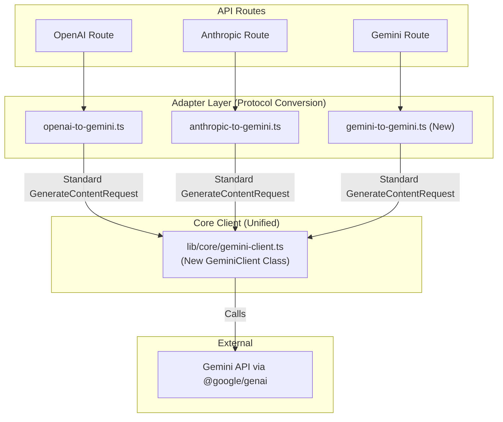

# Refactoring Plan: Unifying the Core API Client

## 1. Introduction & Goal

This document outlines the definitive plan to refactor the core API handling logic. The primary goal is to **unify the request pipeline for all protocols (OpenAI, Anthropic, and native Gemini)** by replacing the current disparate implementations with a single, robust, and maintainable architecture.

The core of this refactor involves:

1.  Creating a new **`GeminiClient`** using the official **`@google/genai` SDK**.
2.  **Deprecating the existing `lib/proxy/gemini-proxy.ts`** and migrating its functionality into a new, standardized adapter.
3.  Ensuring all requests flow through a consistent `API Route -> Adapter -> Client` pipeline.

## 2. Core Problem & Solution

Currently, the system has two distinct pipelines:

- **Non-native (OpenAI/Anthropic):** `Route -> Adapter -> lib/core/gemini-client.ts`
- **Native (Gemini):** `Route -> lib/proxy/gemini-proxy.ts`

This creates complexity and code duplication. The solution is to create a unified pipeline where the native Gemini protocol is treated just like any other protocol that needs to be adapted.

## 3. Final Architecture

The new, unified architecture will be as follows:

## 4. Key Changes & Migration Path

### 4.1. `lib/core/gemini-client.ts` (New Implementation)

- Will be rewritten as a `GeminiClient` class using `@google/genai`.
- Its **only** responsibility is to execute a standard `GenerateContentRequest`, handle retries, manage keys, and log results.
- It will be completely agnostic of the original request's protocol.
- It will implement the precise retry logic defined in previous discussions (60s total timeout, 5s delay between retries).

### 4.2. `lib/adapters/` (Standardization)

- **Naming Convention**: To improve maintainability, all adapters will adhere to a strict, unified function naming convention:
  - **`transformRequest(reqBody: any, model: string): GenerateContentRequest`**: Converts upstream request to a standard Gemini request.
  - **`transformResponse(geminiResult: GenerateContentResult, model: string): any`**: Converts a non-streaming Gemini result to the upstream protocol's response.
  - **`transformStream(geminiStream: AsyncIterable<GenerateContentResult>, model: string): AsyncGenerator<string>`**: Converts a streaming Gemini result to the upstream protocol's SSE stream format.
- **`gemini-to-gemini.ts` (New File)**: This new adapter will implement the `transformRequest` interface. It will absorb the complex request-building logic currently in `lib/google/google-adapter.ts`'s `buildGeminiRequest` function.

### 4.3. `lib/proxy/gemini-proxy.ts` (To Be Deprecated)

- This file will be **removed** after its logic is successfully migrated to the new `GeminiClient` and the `gemini-to-gemini` adapter.

### 4.4. API Routes (`app/(api)/*`)

- The Gemini route (`app/(api)/gemini/v1beta/[...model]/route.ts`) will be updated to call the new `gemini-to-gemini` adapter's `transformRequest` function.
- All routes will use the same instance of the new `geminiClient`.
- All routes will implement standardized `try...catch` blocks to handle errors from the client and return user-friendly JSON responses.

## 5. Final Implementation Steps

The implementation will proceed in the following order after switching to `code` mode.

1.  **Environment Setup**: Install the `@google/genai` dependency.
2.  **Client Implementation**: Implement the new `GeminiClient` class in `lib/core/gemini-client.ts`.
3.  **Adapter Implementation**:
    - Create the new `gemini-to-gemini.ts` adapter.
    - Refactor existing adapters (`openai-to-gemini`, `anthropic-to-gemini`, etc.) to conform to the new naming convention.
4.  **Route Integration**:
    - Update the Gemini API route to use the new adapter and client.
    - Update the OpenAI and Anthropic routes to use the new client and refactored adapters.
5.  **Cleanup**: Delete `lib/proxy/gemini-proxy.ts`.
6.  **Testing**: Manually verify that all three protocols (OpenAI, Anthropic, Gemini) are still working correctly.
